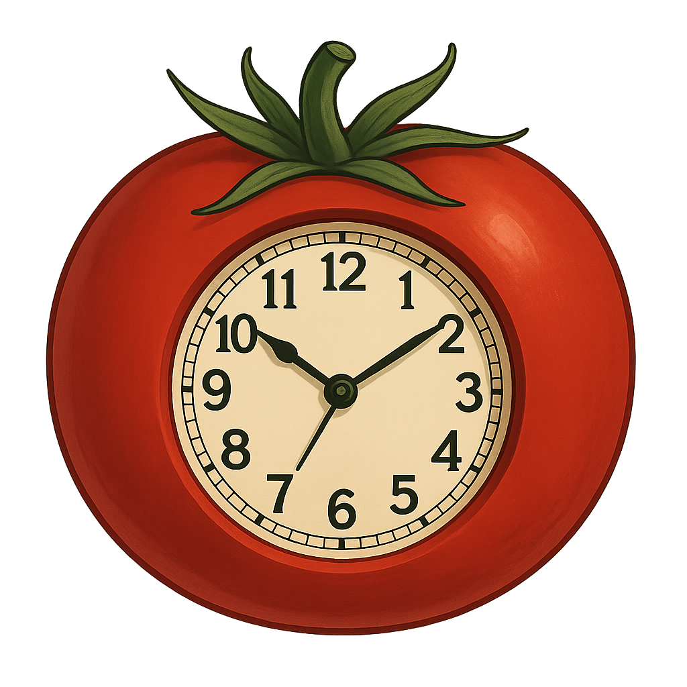

<h1 align="center">  
 
 POMODORO TIMER
 
</h1>

---

## About that :clipboard:
It's a bit simple code with a lot of funcionality, this is my first write program I have ever created, I do it with out chat gpt or searching in web, so I'm very proud of what I make and I will getting it better with the time I will improve it.

---

## Why python 
The question is why not, I choose it for the simplicity that oder languajes don't give I know that `C#` is a lot better but also it looks like hell, so for muy first one I definitly choose python, may be in the future I will change it.

---

## Using information :exclamation:

### Dependences :scroll:
You just need to install the lastest version of `python`. You can download it for the [oficial web site](https://www.python.org/downloads/)

### How to run it :runner:
Go to [relases](https://github.com/theGeorge404/pomodoro-timer/releases) and download the file named `pomodoro_timer.py` execute it every time to use it. 

---
## Bugs :bug:
May you will discover some bugs while using the program, please contact me to repair it.

### Known Bugs :anger:
- The personaliced timer featured doesn't work properly

---
## Error Definitions :book:

### About that :clipboard:
I decided to create a numberd sistem error just for see a feature if it didn't convince me I will remove it.

### Errors :skull:

- `404` command not found
- `101` imposible value for time on and time off
- `102` imposible value for time on
- `103` imposible value for time off

